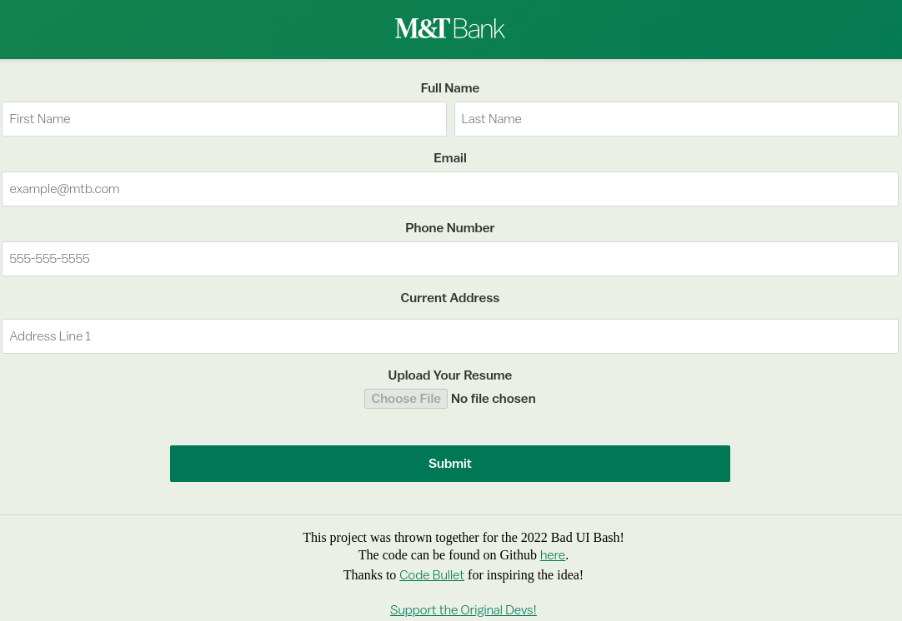

# Bad UI Bash 2022

This is my entry to this year's Bad UI Bash. This project involves creating awful user interfaces *intentionally*. For this year, our task was to create a resume submission page with a twist.

## How'd you make it?

This project was created in html/css/js, using the external `p5.js` library and a slightly modified version of M&T's currency design system. Any custom assets were created using GIMP and a little bit of patience.

  
Spoiler Warning (try the project first!)

  
  This project was **heavily** inspired by Code Bullet's video [AI Learns to play JUMP KING](https://www.youtube.com/watch?v=DmQ4Dqxs0HI). His solution was used as a base for this project, before trimming down a lot of code to remove the AI aspect and removing some unnecessary components like diagonal lines (I debated keeping this in, but in testing, it made the project a bit too difficult for players).

  Levels were redrawn in GIMP using pictures taken by myself. I tried to pixelate everything to both keep in the style of the game, but also to keep anyone's identity private.

## How can I try it?

You can clone this repository and simply open the index.html file in your browser, and you should be able to locally host a copy of this project!

Alternatively, I'll also be hosting this on github pages [here](https://dcl5255.github.io/baduibash-2022/)!